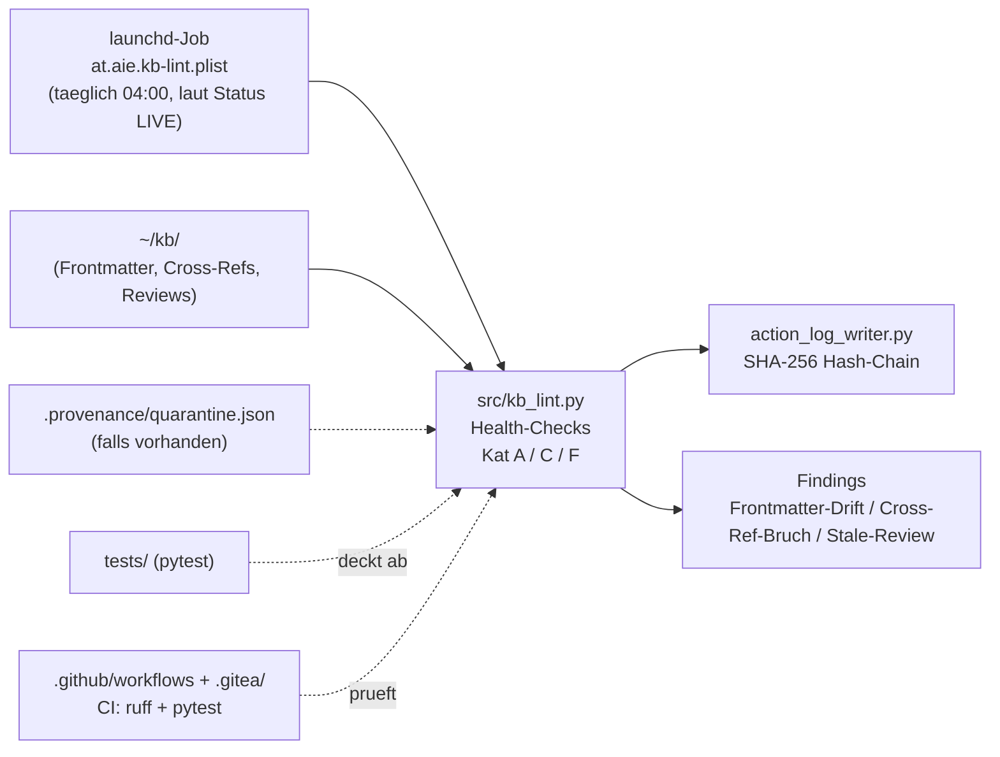

# kb-lint

**Automatisierte Karpathy-Stage-6-Gesundheitsprüfung für `~/kb/`: findet Frontmatter-Drift, kaputte Cross-Refs und veraltete Reviews, bevor sie im Wissenssystem unbemerkt verrotten.**

> Stand: 2026-05-27 · Status: Bauteil-Mac (Reife-5) · Sichtbarkeit: public · Bauteil-ID: #79 (M40, Reife-5)
> *(Metadaten aus vorherigem README übernommen — in dieser Session nicht neu live verifiziert, siehe Status-Abschnitt)*

## Warum wir es haben

`~/kb/` ist die SSOT-Wissensbasis im AIE-Organismus (raw/ → wiki/ → ops/) und wächst laufend durch Compile- und Fileback-Läufe. Ohne automatisierte Kontrolle driften Frontmatter-Felder (Stand/Lock), Cross-Referenzen brechen bei Umbenennungen, und Reviews veralten unbemerkt — genau die Klasse Fehler, die Karpathys "Stage 6: Health Checks"-Muster adressiert. kb-lint ist das Bauteil, das diese Prüfung als eigenständigen, wiederholbaren Health-Check-Layer bereitstellt statt sie manuell/ad-hoc zu machen, mit A33-Vakzine (kein Fake-Finding bei fehlenden Quelldaten) und Anbindung an die Action-Log-Hash-Chain für Nachvollziehbarkeit.



## Was / Wo / Wer

| Bauteil | Was | Wo (Host:Pfad) | Wer nutzt es |
|---|---|---|---|
| `src/kb_lint.py` | Kernskript, Karpathy-Stage-6-Checks: Kat A (Frontmatter-Drift), Kat C (Cross-Ref-Brüche), Kat F (Stale-Reviews) — Kat B/D/E laut altem README als Stubs für W79+ | Repo-Pfad `src/` | launchd (automatisiert, laut Status), Brain (manuell/Debug) |
| `tests/` | pytest-Testsuite | Repo-Pfad `tests/` | CI (.github/workflows), Brain vor Commit |
| `at.aie.kb-lint.plist` | launchd-Job-Definition, soll `kb_lint.py` täglich 04:00 anstoßen | Repo-Pfad `at.aie.kb-lint.plist`; deployter Ziel-Pfad auf Mac (`~/Library/LaunchAgents/…`) ❓ nicht im Kontext belegt | launchd auf Mac (Bauteil-Host laut Status) |
| `~/kb/` | Ziel-Wissensbasis, die gescannt wird | Mac: `~/kb/` | `kb_lint.py` als Eingabequelle |
| `.provenance/quarantine.json` | Optionale Quarantäne-Statusdatei; fehlt sie → leeres Result (A33, kein Fake-Finding) | `~/kb/.provenance/` (Pfad aus altem README übernommen, nicht frisch geprüft) | `kb_lint.py` |
| `action_log_writer.py` | Action-Logging aller non-trivialen Aktionen, SHA-256-Hash-Chain | ❓ Pfad/Repo nicht im gelieferten Tree sichtbar (vermutlich externes/gemeinsames Modul) | `kb_lint.py` |
| `.github/workflows/`, `.gitea/` | CI: ruff + pytest (laut altem README für GitHub; `.gitea/`-Verzeichnis vorhanden, Inhalt nicht gelesen) | Repo-Pfad `.github/workflows/`, `.gitea/` | Gitea Actions / GitHub Actions bei Push |
| `CLAUDE.md` (repo-lokal) | Repo-spezifische Regeln/Kontext | Repo-Root | Claude/Brain bei Arbeit in diesem Repo (Inhalt in dieser Session nicht gelesen) |

## Vernetzung

- **Skill (bestätigt):** `~/.claude/skills/kb-lint/SKILL.md` — SSOT für das Bauteil; Skill `kb-lint` ist aktuell in der verfügbaren Skill-Liste dieser Session gelistet.
- **Bauteil-Inventar:** `kb/ops/BAUTEILE-INVENTAR.md`, Eintrag #79 (aus altem README übernommen, nicht in dieser Session gegengelesen).
- **Build-Beleg (raw):** `kb/raw/2026-05-27-w78-a-bauteil-79-kb-lint.md`.
- **Methode/Meta-Learning:** M40 (Bezeichnung aus altem README; Inhalt von M40 nicht im gelieferten Kontext).
- **Gitea = Code-SSOT** (AIE-Standard): kanonisch `10.40.10.82:3050/joe/kb-lint`; GitHub (`AI-Engineering-at/kb-lint`, laut altem Quick-Start-Clone-Befehl) ist nur öffentlicher Mirror, Schreibrichtung intern→extern.
- **DEC-Einträge:** "Refactor via DEC-Eintrag (kb/DECISIONS.md)" laut altem README als Prinzip genannt — welche konkrete(n) DEC-Nummer(n) für kb-lint existieren, ❓ zu klären.
- **Verwandte joe/-Repos:** kein anderes `joe/`-Repo im gelieferten Kontext explizit als verknüpft benannt (naheliegend wäre ein `kb`-Repo, da kb-lint `~/kb/` scannt) — ❓ zu klären.
- **MCP-Bezug:** kein MCP-Server im gelieferten Kontext für kb-lint genannt — ❓ zu klären, ob z. B. `aie-kb-reader` denselben Datenraum berührt.

## Status + nächste Schritte

✅ Vorhanden (durch Repo-Tree bzw. altes README belegt):
- `src/kb_lint.py` implementiert laut altem README Kat A/C/F (Stand 2026-05-27).
- `tests/` (pytest) vorhanden.
- CI-Konfiguration vorhanden: `.github/workflows/` (laut altem README ruff + pytest) sowie zusätzlich `.gitea/`-Verzeichnis.
- `at.aie.kb-lint.plist` (launchd-Jobdatei) liegt im Repo.
- `LICENSE` (MIT) vorhanden.
- Bauteil-Eintrag #79 (M40, Reife-5) laut altem README referenziert.

⏳ Geplant/offen (laut altem README):
- Kategorien B/D/E der Health-Checks sind Stubs, geplant für Welle W79+.

❓ Zu klären (nicht aus geliefertem Kontext verifizierbar):
- Ob der launchd-Job aktuell tatsächlich täglich 04:00 läuft ("LIVE") — diese Aussage stammt 1:1 aus dem alten README und wurde in dieser Session **nicht** per Live-Probe (z. B. `launchctl list`) neu geprüft (Verify-vor-Behaupten/M126).
- Inhalt der repo-lokalen `CLAUDE.md` — nicht gelesen.
- Genauer Speicherort/Herkunft von `action_log_writer.py`.
- Exakter Deploy-Pfad des `.plist` auf dem Mac-Host.
- Konkrete DEC-Nummer(n) in `kb/DECISIONS.md` zu kb-lint-Refactors.
- Verknüpfte `joe/`-Repos (z. B. das `kb`-Repo selbst) — kein expliziter Cross-Link im gelieferten Kontext.
- Inhalt von `.gitea/` (nur Verzeichnis-Existenz bekannt, Workflow-Datei nicht gelesen).

---

## Struktur (aus altem README übernommen)

```
kb-lint/
├── src/                 # Source code (Python 3)
├── tests/               # pytest test suite
├── README.md
├── LICENSE
├── CLAUDE.md
├── at.aie.kb-lint.plist
├── .gitea/
└── .github/workflows/   # CI: ruff + pytest
```

## Quick Start

```bash
# Gitea = Code-SSOT (AIE-Standard)
git clone http://10.40.10.82:3050/joe/kb-lint.git
cd kb-lint

# Tests
pytest tests/ -v

# Lint
ruff check src/ tests/
```

*(GitHub-Mirror laut altem README: `https://github.com/AI-Engineering-at/kb-lint.git` — nur lesend, nie als Rückweg nutzen.)*

## Compliance & Doctrine (aus altem README übernommen)

- **A33 (KEIN-MOCK-ABSOLUT):** echte Datenquellen, keine Fake-Fallbacks; fehlt `.provenance/quarantine.json` → leeres Result, keine hardcoded Findings.
- **ISC2-CC-Framing:** laut altem README in `src/`-Headern dokumentiert (CIA-Triade, Risk-Treatment, Defense-in-Depth) — Inhalt in dieser Session nicht gegengelesen.
- **Append-only Code:** Refactor via DEC-Eintrag (`kb/DECISIONS.md`).
- **Action-Logging:** non-triviale Aktionen über `action_log_writer.py` (SHA-256-Hash-Chain).
- **Regel 5 (Aufräumen):** Tempdir-Tests räumen ihr eigenes tmp-Verzeichnis auf.

## License

MIT — siehe [LICENSE](LICENSE).
